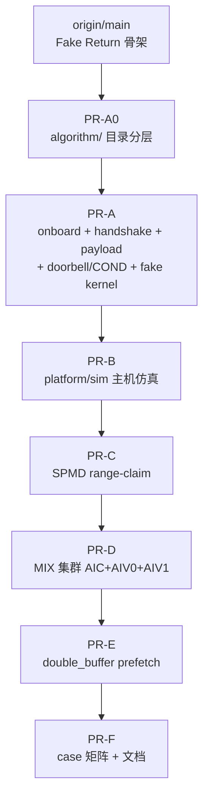
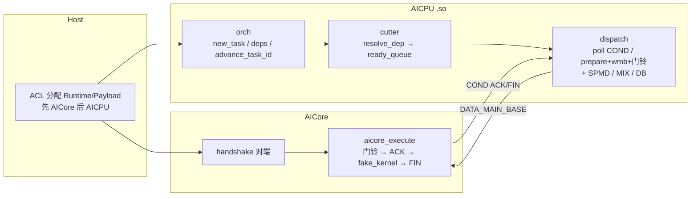
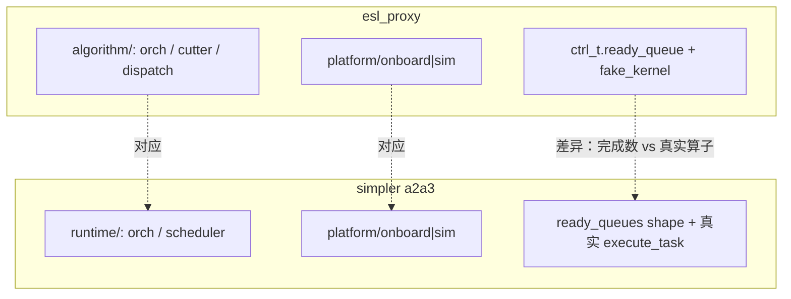

# PR-F：case 验收矩阵与文档规范

相对基线：`pr/E-double-buffer`。

---

## 宏观：本 PR 完成了什么

1. 给出全栈 **总体逻辑图**（PR 能力叠加、Host/AICPU/AICore 主路径、与 simpler 同层对照）  
2. 写清 **case × 能力** 矩阵（PA / qwen3 依赖 A–E 的哪几层）  
3. 统一 `doc/pr/00`–`05` 的写法：每 PR 先宏观、再微观；微观每点含为什么 / 怎么改 / 代码 / simpler 对应 / **双边代码差异**  

PA/qwen3 **源文件在 PR-A 已保留**；本 PR 以文档与验收说明为主，不重复恢复 case 源。

---

## 总体逻辑图

本栈从 `main` 到可上板 / sim / SPMD / MIX / DB 的能力叠加与运行时主路径如下。细节见 `doc/pr/00`–`05`。

### PR 能力叠加



### 运行时主路径（Host / AICPU / AICore）



### 与 simpler 主路径对照（同层异名）



---

## 微观：各部分怎么做

### 1. 能力矩阵文档

- **为什么修改**：写清 case 依赖哪些调度能力。
- **怎么修改**：`doc/pr/06_cases.md` 矩阵 + `CASE=` / `QWEN3_SPMD_TIER=`。
- **相关代码**：

| Case / 场景 | 最低能力 |
|-------------|----------|
| PA 冒烟 | PR-A / PR-B |
| 多 block SPMD | PR-C |
| MIX | PR-D |
| double_buffer | PR-E |
| qwen3 完整 | PR-C + PR-D（±E） |

- **对应 simpler**：examples/ST 目录表达能力。
- **相比 simpler 的区别**：Makefile 矩阵 vs ST 树。对照：

esl_proxy：

```text
doc/pr/06_cases.md
make CASE=paged_attention_unroll_manual_scope.h
make CASE=qwen3_dynamic_manual_scope.h QWEN3_SPMD_TIER=2
```

simpler：

```text
simpler/examples/a2a3/.../paged_attention*
simpler/examples/a2a3/tensormap_and_ringbuffer/qwen3_14b_decode/
simpler/tests/st/a2a3/**/paged_attention*
```

---

### 2. PA case（源在 PR-A）

- **为什么修改**：默认冒烟验证调度闭环。
- **怎么修改**：fake `duration`/`jitter`；矩阵标明依赖。
- **相关代码**：

```c
/* cases/paged_attention_unroll_manual_scope.h */
new_task(g_task_id, TASK_TYPE_CUBE, 1, DUR_QK_MATMUL, MASK_QK_MATMUL);
```

- **对应 simpler**：PA examples/ST。
- **相比 simpler 的区别**：完成数 vs 真实算子。对照：

esl_proxy：

```c
new_task(g_task_id, TASK_TYPE_CUBE, 1, DUR_QK_MATMUL, MASK_QK_MATMUL);
/* → fake_kernel_run(duration_ns, jitter_mask) */
```

simpler：

```36:42:simpler/src/a2a3/runtime/tensormap_and_ringbuffer/aicore/aicore_executor.cpp
__aicore__ __attribute__((always_inline)) static void execute_task(__gm__ PTO2DispatchPayload *payload) {
    if (payload == nullptr || payload->function_bin_addr == 0) {
        return;
    }
    UnifiedKernelFunc kernel = (UnifiedKernelFunc)payload->function_bin_addr;
    kernel(reinterpret_cast<__gm__ int64_t *>(payload->args));
```

---

### 3. qwen3 MIX / 多 block

- **为什么修改**：覆盖 SPMD+MIX 组合。
- **怎么修改**：图含 `TASK_TYPE_MIX`；依赖 PR-C/D。
- **相关代码**：

```c
new_task(g_task_id, TASK_TYPE_MIX, (uint16_t)cur_blocks, DUR_OUT_PROJ, MASK_OUT_PROJ);
```

- **对应 simpler**：`qwen3_14b_decode` example。
- **相比 simpler 的区别**：调度能力按 PR 叠；cutter MIX 入队问题见 `04_mix.md` §5。对照：

esl_proxy：

```c
new_task(g_task_id, TASK_TYPE_MIX, (uint16_t)cur_blocks, DUR_OUT_PROJ, MASK_OUT_PROJ);
```

```32:36:esl_proxy/src/algorithm/cutter.c
static inline int ready_queue_index(task_type_t type)
{
    if (type == TASK_TYPE_MIX) {
        return TASK_TYPE_CUBE;
```

simpler：

```60:65:simpler/src/a2a3/runtime/tensormap_and_ringbuffer/runtime/pto_submit_types.h
enum class PTO2ResourceShape : uint8_t {
    AIC = 0, AIV = 1, MIX = 2, DUMMY = 3,
};
```

```text
simpler/examples/a2a3/tensormap_and_ringbuffer/qwen3_14b_decode/
```

---

### 4. 文档五段式（含双边贴码）

- **为什么修改**：每个改动点要同时看到动机、做法、本仓代码、simpler 对应，以及**双边代码对照差异**。
- **怎么修改**：`doc/pr/00`–`06` 每一点含：为什么 / 怎么改 / 相关代码 / 对应 simpler / 相比区别（esl + simpler 代码）。
- **相关代码**：本目录全部 `doc/pr/*.md`。
- **对应 simpler**：`src/a2a3/docs/*.md` + 代码注释。
- **相比 simpler 的区别**：按 PR 拆文件并强制双边贴码。对照：

esl_proxy：

```text
doc/pr/00_layout.md … 06_cases.md
# 每点：**相比 simpler 的区别** 下同时贴 esl_proxy 与 simpler 代码
```

simpler：

```text
simpler/src/a2a3/docs/platform.md
simpler/src/a2a3/docs/runtimes.md
```
