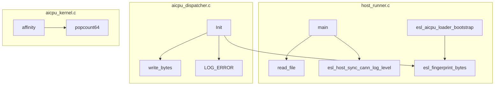
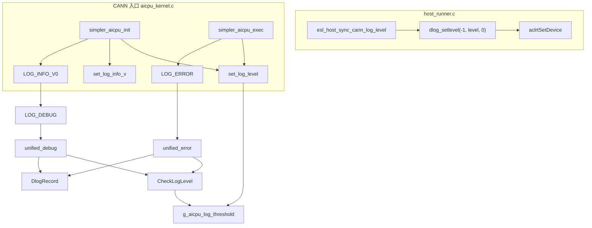

# `tools.h` / `onboard_log.h` 符号调用关系分析

分析对象：`include/onboard/tools.h`（工具）、`include/onboard/onboard_log.h`（AICPU CANN 日志）。  
扫描范围：`esl_proxy/src/onboard/*`、`esl_proxy/src/{cutter,dispatch,shm}.c`（AICPU 构建）、Host/Dispatcher 独立目标。  
方法：全仓库 `rg` 静态引用 + 构建目标 include 路径区分 Host CSV `include/log.h` 与 onboard 头。

---

## 1. 头文件角色

| 头 | 用途 | 主要消费者 |
|----|------|-----------|
| `tools.h` | 文件 I/O、ELF fingerprint、dispatcher 偏移宏 | Host runner、Dispatcher、AICPU kernel |
| `onboard_log.h` | AICPU CANN 日志（`LOG_*` 对齐 `DLOG_*`；`LOG_INFO_V0`→`DLOG_DEBUG`） | `aicpu_kernel.c`、`aicpu_dispatcher.c` |
| `include/log.h` | Host 仿真 CSV 日志（`WORKER_LOGF` / `MAIN_LOGF`） | `cutter.c`、`dispatch.c`、`log.c`、Host sim |

AICPU 构建 include 顺序为 `include/onboard` → `include`。`cutter/dispatch` 的 `#include "log.h"` 解析到 Host CSV 版，与 onboard 日志无冲突。

---

## 2. 日志架构（CANN 对齐）

### 2.1 级别映射

| esl_proxy 宏 | CANN 级别 | 说明 |
|--------------|-----------|------|
| `LOG_ERROR` | `DLOG_ERROR` | |
| `LOG_WARN` | `DLOG_WARN` | |
| `LOG_DEBUG` | `DLOG_DEBUG` | |
| `LOG_INFO_V0` | `DLOG_DEBUG` | 里程碑/摘要类，降为 debug |
| `LOG_INFO_V1`…`V9` | `DLOG_INFO` | 经 `g_log_info_v` 过滤（`v >= g_log_info_v` 才输出） |

### 2.2 双重门控

1. **CANN `CheckLogLevel(AICPU, level)`** — 模块阈值在 Host `aclrtSetDevice` 前由 `dlog_setlevel(-1, …)` 或 `ASCEND_GLOBAL_LOG_LEVEL` 等环境变量决定（设备侧不再调用 `dlog_setlevel`）。
2. **`g_aicpu_log_threshold`** — 设备侧本地过滤，由 `k_args->log_level` 经 `set_log_level()` 写入（`DLOG_DEBUG`…`DLOG_ERROR`，仅输出 `level >= threshold` 的消息）。

### 2.3 全局变量（`onboard_log_globals.c`）

| 符号 | 定义位置 | 链接 |
|------|----------|------|
| `g_log_info_v` | `onboard_log_globals.c` | `libaicpu_kernel.so`、`libsimpler_aicpu_dispatcher.so` 各一份 |
| `g_aicpu_log_threshold` | 同上 | 同上 |

Host 侧在 `aclInit` 后、`aclrtSetDevice` 前调用 `esl_host_sync_cann_log_level()`（见 `host_runner.c`）。

---

## 3. 符号总览（是否被调用）

### 3.1 工具函数 / 宏（`tools.h`）

| 符号 | 类型 | 是否调用 | 直接调用方 |
|------|------|:--------:|------------|
| `DISPATCHER_KERNEL_ARGS_DEVICE_ARGS_OFF` | 宏 | ✅ | `aicpu_dispatcher.c` |
| `DISPATCHER_DEVICE_ARGS_*_OFF`（5 个） | 宏 | ✅ | `host_runner.c`、`aicpu_dispatcher.c` |
| `popcount64` | inline | ✅ | `platform_aicpu_affinity_gate` |
| `fnv1a64` / `read_elf_build_id` | inline | ⚪ 间接 | `esl_fingerprint_bytes` |
| `esl_fingerprint_bytes` | inline | ✅ | `host_runner.c`、`aicpu_dispatcher.c` |
| `grow_array` | inline | ✅ | `host_runner.c` |
| `read_file` | inline | ✅ | `host_runner.c` |
| `write_bytes` | inline | ✅ | `aicpu_dispatcher.c` |

### 3.2 日志层（`onboard_log.h`）

| 符号 | 类型 | 是否调用 | 说明 |
|------|------|:--------:|------|
| `g_log_info_v` | 全局 | ✅ | `set_log_info_v` / `unified_log_info_v` |
| `g_aicpu_log_threshold` | 全局 | ✅ | `set_log_level` / `esl_onboard_msg_level_enabled` |
| `set_log_level` | inline | ✅ | `simpler_aicpu_init`、`simpler_aicpu_exec`（仅写本地阈值，不调 `dlog_setlevel`） |
| `set_log_info_v` | inline | ✅ | 同上 |
| `esl_onboard_vlog` | inline | ⚪ 间接 | 经 `unified_log_*` → `DlogRecord` |
| `unified_log_error/warn/debug/info_v` | inline | ⚪ 间接 | 经 `LOG_*` 宏 |
| `LOG_ERROR` | 宏 | ✅ | 见 §4.2 |
| `LOG_WARN` | 宏 | ✅ | `platform_aicpu_affinity_gate` |
| `LOG_DEBUG` | 宏 | ❌ | 预留 |
| `LOG_INFO_V0` | 宏 | ✅ | → `LOG_DEBUG`；affinity / handshake / CANN 入口 |
| `LOG_INFO_V1`…`V9` | 宏 | ❌ | 预留 verbosity |

已删除（P0–P4）：`init_log_switch`、`g_is_log_enable_*`、`dev_vlog_*`、`get_log_info_v`、独立 `dispatcher_log`、AICPU 构建中的 `log.c`。

---

## 4. 调用关系图

### 4.1 工具函数（同前）

### 4.2 AICPU 日志调用链

### 4.3 `LOG_*` 宏 → 源函数映射

| 宏 | 次数 | 所在函数 |
|----|:----:|----------|
| `LOG_ERROR` | 18+ | `resolve_hal_mem`、`platform_aicpu_affinity_gate_filter`、`esl_handshake_all_cores`、`esl_shutdown_all_cores`、`simpler_aicpu_*` 等 |
| `LOG_WARN` | 1 | `platform_aicpu_affinity_gate` |
| `LOG_INFO_V0` | 10 | `platform_aicpu_affinity_gate`、`platform_aicpu_affinity_gate_filter`、`esl_handshake_all_cores`、`esl_shutdown_all_cores`、`simpler_aicpu_init` |

---

## 5. 按构建目标的使用矩阵

| 符号 | Host runner | Dispatcher `.so` | AICPU `.so` |
|------|:-----------:|:----------------:|:-----------:|
| `read_file` / `grow_array` | ✅ | — | — |
| `esl_fingerprint_bytes` / `write_bytes` | ✅ | ✅ | — |
| `DISPATCHER_*_OFF` | ✅ | ✅ | — |
| `popcount64` | — | — | ✅ |
| `esl_host_sync_cann_log_level` | ✅ | — | — |
| `onboard_log.h` / `LOG_*` | — | ✅ | ✅ |
| `onboard_log_globals.c` | — | ✅ | ✅ |

---

## 6. 与 Host CSV 日志的边界

| | `onboard_log.h` | `include/log.h` |
|--|-----------------|-----------------|
| 后端 | CANN `DlogRecord` / `CheckLogLevel` | 线程 CSV / stdout |
| 宏 | `LOG_ERROR`、`LOG_INFO_V0` 等 | `WORKER_LOGF`、`MAIN_LOGF` |
| AICPU 构建 | kernel + dispatcher | `cutter.c` / `dispatch.c`（`-DWORKER_LOG=0 -DMAIN_LOG=0` 静默） |

二者宏名部分重叠，include 路径已分离，无 ODR/宏冲突。
