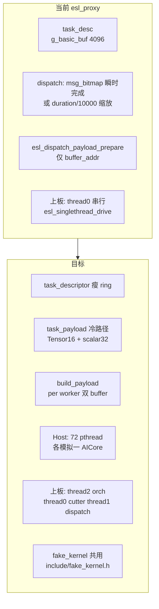

# PTO2 增量对齐 + Host 72 核 Fake Kernel + 三线程上板

> 计划文档。增量对齐 Simpler `tensormap_and_ringbuffer` 的 descriptor/payload/dispatch 三层；Host 72 worker 各一线程 fake kernel；上板 orch/cutter/dispatch 三 AICPU 线程；fake_kernel 移出 `onboard/`。

## 待办

- [ ] **P1** 拆分 `task_desc` → `task_descriptor` + `g_task_payload[RING_SIZE]`；ring_buf/tensormap submit 时 materialize Tensor
- [ ] **P2** 新增 `dispatch_payload.h/.c` 与 `esl_build_dispatch_payload`；Host GM 数组 + 上板 `esl_dispatch_payload_prepare` 共用
- [ ] **P3** 新增 `fake_aicore_host.c`：72 worker pthread、替换 dispatch instant msg_bitmap 与 duration 缩放
- [ ] **P4** `fake_kernel.h` 移出 onboard；删 `onboard_tensor.h`；`aicore_kernel.cpp` 仅保留寄存器/swimlane 壳
- [ ] **P5** `esl_aicpu_execute` 按 idx 分流 orch/cutter/dispatch；cache flush/invalidate；移除 singlethread 主路径

---

## 现状与目标



| 层级 | Simpler PTO2 | 当前 esl_proxy | 目标 |
|------|-------------|----------------|------|
| Ring 瘦描述 | `PTO2TaskDescriptor` | 整包 `task_desc` | `task_descriptor`（id/type/mode/kernel/index/count/duration） |
| 参数 bulk | `PTO2TaskPayload` | `data[]`/`scalar[]` 在 `task_desc` | `g_task_payload[RING_SIZE]` |
| 调度状态 | `PTO2TaskSlotState` | `g_state_buf` + `g_predecessor_cnt` | **保留**，仅补 SPMD `next_block` 若需要 |
| AICore 读 | `PTO2DispatchPayload` | `EslFakeDispatchPayload` | 抽到 `include/dispatch_payload.h` |
| Tensor | `Tensor[128B]` | 编排只存 `buffer_addr` | `tm_submit`/`commit` 时 `payload.init` 拷贝完整 Tensor |

**已确认选项**：增量拆分（不引入 PTO2 多 ring SM）；Host fake kernel **72 worker 线程**（与 `RUNTIME_MAX_WORKER=72` 一致）。

---

## Phase 1：数据模型拆分（PTO2 增量）

### 1.1 新类型（`include/task.h` + 新头 `include/task_payload.h`）

- **`task_descriptor`**（替换/瘦身 `task_desc` 热路径字段）：
  - 保留：`id`, `type`, `mode`, `kernel`, `index`, `count`, `duration`, `jitter_mask`
  - **移除**：`data[16]`, `scalar[32]`, `tensor_cnt`, `scalar_cnt`
- **`task_payload`**（对齐 `PTO2TaskPayload` 语义，纯 C）：
  - `uint16_t tensor_cnt`, `scalar_cnt`
  - `Tensor tensors[16]`（复用 `include/tensor.h`，128B）
  - `int64_t scalars[32]`
  - `task_payload_init_from_task(uint16_t tid)`：从 pending Tensor 快照写入（在 submit 时调用）

- **`g_basic_buf[RING_SIZE]`** 改为 `task_descriptor`；新增 **`g_task_payload[RING_SIZE]`**（`src/shm.c`）。

### 1.2 编排路径（`include/ring_buf.h`）

- `add_*_ptr` 继续只登记指针/地址到 **pending 区**（或临时栈 Tensor），**不**写 128B 进 ring。
- 在 **`new_task` 提交 / `tm_submit`** 时调用 `task_payload_materialize(task_id)`：
  - 从 `add_input` 宏捕获的 Tensor 拷贝进 `g_task_payload[slot]`（对齐 Simpler `PTO2TaskPayload::init`）。
- `tensormap.h` 的 `tm_submit` 末尾增加 materialize 钩子。

### 1.3 读路径改动

- `src/cutter.c`：仍读 `g_basic_buf[].type`（descriptor）。
- `src/dispatch.c` / `src/aicpu_runtime.c`：`esl_pack_dispatch_input` 从 **`g_task_payload`** 取 Tensor/scalar，不再从 `data[]`。

**验收**：`make CASE=qwen3_dynamic_tensormap.h run` 编排耗时回到 ~300µs 量级（无 128B×4096 ring 膨胀）；功能与现网 case 一致。

---

## Phase 2：统一 `build_payload`（Host + 上板）

### 2.1 抽出共享 API（新 `include/dispatch_payload.h`）

从 `include/onboard/onboard_config.h` **迁出**（onboard 仅 `#include`）：

- `EslDispatchTaskMeta`（原 `EslOnboardTaskDesc`）
- `EslDispatchInput`（原 `EslOnboardDispatchInput`）
- `EslDispatchPayload`（原 `EslFakeDispatchPayload`）
- 常量 `ESL_MAX_TENSOR_ARGS=16`, `ESL_MAX_SCALAR_ARGS=32`

删除重复类型 `include/onboard/onboard_tensor.h`：`EslDispatchPayload.tensors[]` 直接使用 `Tensor`（已有 `_Static_assert(sizeof==128)`）。

### 2.2 `build_payload()`（新 `src/dispatch_payload.c`）

对齐 Simpler `scheduler_dispatch.cpp::build_payload`：

```c
void esl_build_dispatch_payload(EslDispatchPayload *out,
    const task_descriptor *desc, const task_payload *pay,
    int block_idx, int block_num);
```

- `args[i]` = `(uint64_t)&out->tensors[i]`（GM/host 内存地址）
- scalars 填入 `args[tensor_cnt..]`
- SPMD：`task.index` + block 推导写入 meta（后续可补 LocalContext 字段）
- `duration_ticks` / `jitter_mask` 来自 descriptor（fake kernel 专用）

### 2.3 Per-worker 双 buffer

- Host：静态数组 `g_payload_per_worker[72][2]` + `g_worker_pending[72]`（reg_task_id、logical exe_type/core/slot、block_idx）。
- 上板：继续用 `EslRuntime.workers[i].task` GM 基址（`aicpu_platform.c` `esl_dispatch_payload_prepare` 改为调用 `esl_build_dispatch_payload` + `cache_flush`）。

**验收**：上板 smoke + qwen3 case；payload 内 Tensor 含完整 shape/stride，AICore 可读 `args[]` 解包。

---

## Phase 3：Host 72 核 Fake Kernel 线程模型

### 3.1 替换 instant fake return

当前 Host 路径（`dispatch.c` `#else`）在 `send_task` 里直接 `atomic_fetch_or msg_bitmap`，**且** `duration/10000` 缩放——与上板语义不一致。

改为与上板同构：

1. `send_task` → `host_dispatch_task()`：写 `g_payload_per_worker[phys][reg&1]`、`g_worker_pending[phys]`，**不**立即置 completion。
2. 启动 **72 个 `fake_aicore_worker` pthread**（`src/fake_aicore_host.c`），`worker_id = 0..71`。
3. 每线程循环：
   - 读 `g_worker_pending[w]`；若有新 `reg_task_id`
   - 调 `esl_fake_kernel_busy_wait(&payload, get_time_ns, 1e9)`（见 Phase 4）
   - SPMD：若 `block_idx < block_num`，更新 pending 发下一块；否则 `host_signal_completion(exe_type, core, slot)` 置 `msg_bitmap`
4. `main.c`：`pthread_create` 72 workers + 现有 cutter/dispatch/orch 线程；join 顺序与 today 相同。

### 3.2 逻辑 core → phys worker 映射

复用上板 `esl_pick_phys_worker(core, exe_type)` 到 **共享** `include/worker_map.h`（Host/Onboard 共用）：24 AIC + 48 AIV = 72。

Host dispatch 的 `free_bitmap` 仍按 blockdim=24 mask（已有 `#ifdef ESL_PROXY_ONBOARD` 逻辑可推广为 `ESL_PROXY_WORKER_MODEL=onboard72`）。

### 3.3 删除/废弃

- 移除 `duration/10000` 缩放（`dispatch.c:104-105`）。
- `executor.c` 的 tick 递减模型**不再使用**（可 `#if 0` 或从 Makefile 移除）。

**验收**：Host `make run` 总耗时与上板 swimlane duration 分布一致（ns 级 busy-wait，非 tick）；72 线程下无死锁/stall。

---

## Phase 4：fake_kernel 移出 onboard/

**结论：可以移出，且应该移出**——busy-wait 与 payload 布局与设备无关；留在 onboard 会导致 Host 无法复用、类型重复（`EslOnboardTensor` vs `Tensor`）。

| 文件 | 动作 |
|------|------|
| 新 `include/fake_kernel.h` | `esl_fake_kernel_busy_wait(const EslDispatchPayload *, uint64_t (*now)(void), uint64_t freq_hz)`；duration/jitter 算法从 `aicore_kernel.cpp:24-49` 原样迁入 |
| 新 `src/fake_aicore_host.c` | 72 worker 线程 + completion 信号 |
| `src/onboard/aicore_kernel.cpp` | 保留 **仅设备相关**：寄存器 poll、`dcci`、`write_reg ACK/FIN`、swimlane；`fake_kernel()` 改为调用 `esl_fake_kernel_busy_wait(..., get_sys_cnt_aicore, ESL_ONBOARD_SYS_CNT_FREQ)` |
| `include/onboard/onboard_config.h` | 只留 REG 常量、SYS_CNT、`ESL_PROXY_ONBOARD_*`；payload 类型删掉 |
| `include/onboard/onboard_tensor.h` | **删除**，统一 `tensor.h` |

构建：

- Host `Makefile` 增加 `fake_aicore_host.c`, `dispatch_payload.c`。
- AICPU `build_aicpu.sh` 增加 `dispatch_payload.c`（若 AICPU 侧 build_payload 放 C 文件）。
- AICore ccec 仅编译 `.cpp`，fake 逻辑通过 **header inline** 或 `.cpp` 内 `#include "fake_kernel.h"`。

---

## Phase 5：上板三 AICPU 线程（与 Phase 1–2 同批或紧随其后）

修改 `esl_aicpu_execute`（`src/aicpu_runtime.c`）：

| thread idx | 角色 | 入口 |
|------------|------|------|
| 2 | Orchestrator | `aicpu_orchestration_entry` → `esl_signal_orch_done` → `ESL_SWIMLANE_SET_ORCH_THREAD(2)` |
| 0 | Cutter | `cutter_loop_run(0)`（已有 pthread 路径） |
| 1 | Dispatch | `dispatch_loop_run(0)` + `aicore_bridge_poll_completions` |

- **删除** thread0 上的 `esl_singlethread_drive()` 主路径（可 `#ifdef ESL_PROXY_SINGLETHREAD_DRIVE` 保留 bring-up 回退）。
- 跨核队列：cutter 写 ready/completed 后 **`cache_flush_range`**；dispatch/cutter 读前 **`cache_invalidate_range`**（扩展 `esl_onboard_flush_shared_after_orch` 为增量 flush 助手）。
- `esl_dispatch_payload_prepare` 仅在 **dispatch 线程（idx=1）** 调用。

**验收**：`ESL_PROXY_L2_SWIMLANE_LEVEL=0|2 bash tools/run_onboard_npu.sh` 连续 PASS；泳道显示 sched thread 0/1、orch thread 2。

---

## 执行顺序（合并交付）

```mermaid
gantt
  title 实施顺序
  dateFormat X
  axisFormat %s

  section DataModel
  Phase1_descriptor_payload :0, 3
  section PayloadPath
  Phase2_build_payload :3, 2
  section HostSim
  Phase3_72_fake_threads :3, 3
  section Extract
  Phase4_move_fake_kernel :5, 2
  section Onboard
  Phase5_3_aicpu_threads :7, 3
```



建议 **Phase 1+2+4 先做**（类型与 build_payload 统一），**Phase 3 与 Phase 2 并行**（Host 72 线程依赖 payload 数组），**Phase 5 最后**（依赖 cache 同步验证）。

---

## 风险与约束

- **72 pthread Host**：qwen3 短跑可接受；长跑可考虑 `ESL_PROXY_FAKE_WORKERS=N` 环境变量降线程数（默认 72）。
- **三线程上板**：queue spinlock 在 AICPU 跨核无效——必须用 flush/invalidate + 单 writer 约定（cutter 写 ready，dispatch 写 completed）或 per-thread 队列；实施前重读 `report/onboard_lock_atomic_and_507018.md` E2 项。
- **Case 兼容**：四个 `cases/*.h` 无需改 API（`add_input`/`tm_*` 宏保持）；仅 ring 布局变化。
- **不做的范围**（本次）：PTO2 多 ring GM 布局、`PTO2TaskSlotState` 全量 C 移植、真实 kernel 执行。

---

## 测试计划

| 阶段 | Host | 上板 |
|------|------|------|
| P1 | `make CASE=qwen3_dynamic_tensormap.h run` 编排 ns + 总 ns | smoke |
| P2 | 断点/check 打印 payload tensor ndims | AICore log / swimlane |
| P3 | 对比修改前后 scheduler duration；确认无 instant complete | — |
| P5 | — | onboard ×5 非泳道 + 泳道 |

---

## 参考

- Simpler PTO2 类型：`simpler/src/a2a3/runtime/tensormap_and_ringbuffer/runtime/pto_runtime2_types.h`
- Simpler build_payload：`simpler/src/a2a3/runtime/tensormap_and_ringbuffer/runtime/scheduler/scheduler_dispatch.cpp`
- 上板锁/原子分析：`report/onboard_lock_atomic_and_507018.md`
